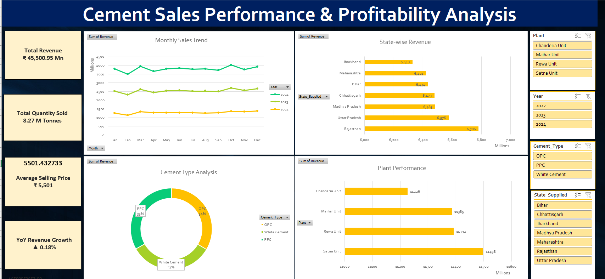

# cement-sales-dashboard-excel
Excel-based sales analytics dashboard for monitoring revenue, volume, product performance, and regional sales trends.

# Cement Sales Dashboard (Excel)

## Business Problem
A cement company needed visibility into sales performance across regions, products, and time periods.

## Objective
Develop an Excel dashboard to track KPIs and identify sales trends.

## Tools Used
- Microsoft Excel
- Pivot Tables
- Pivot Charts
- Slicers
- KPI Cards

## Dashboard Preview

## Key KPIs
- Total Revenue
- Total Quantity Sold
- Top Product
- Best Performing Region

## Business Insights

- Rajasthan generated the highest revenue.
- Satna Unit delivered the strongest plant performance.
- OPC cement contributed the highest revenue share.
- Revenue showed consistent growth from 2022 to 2024.
- Average selling price remained above ₹5,500 per tonne.
  
## Business Impact

This dashboard enables management to:
- Monitor sales performance
- Track plant productivity
- Compare regional revenue
- Identify growth opportunities
- Support data-driven decisions

## Skills Demonstrated
- Data Cleaning
- Data Analysis
- Dashboard Development
- KPI Reporting
